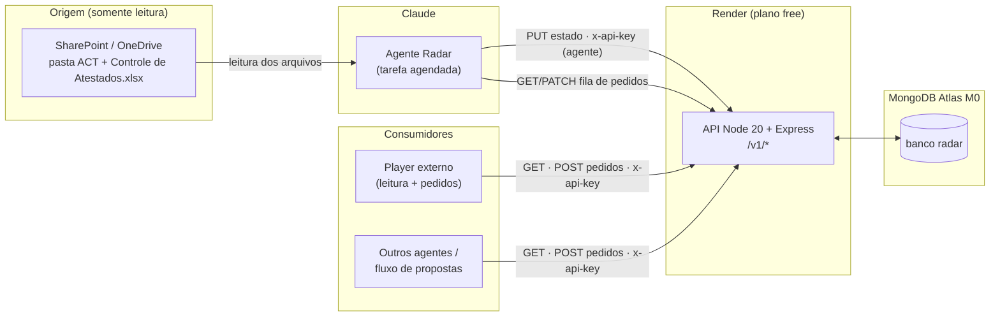
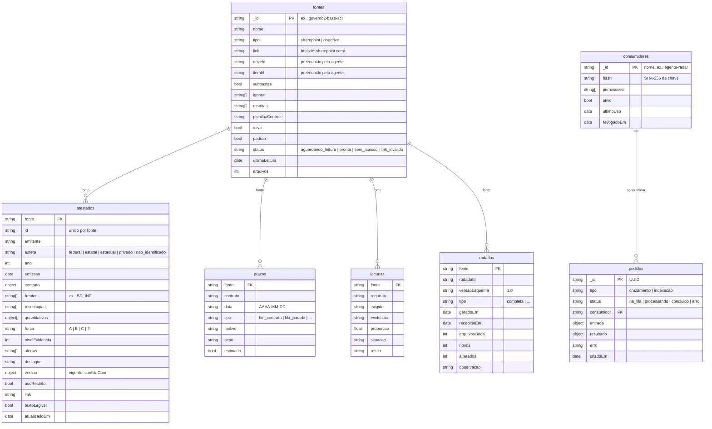
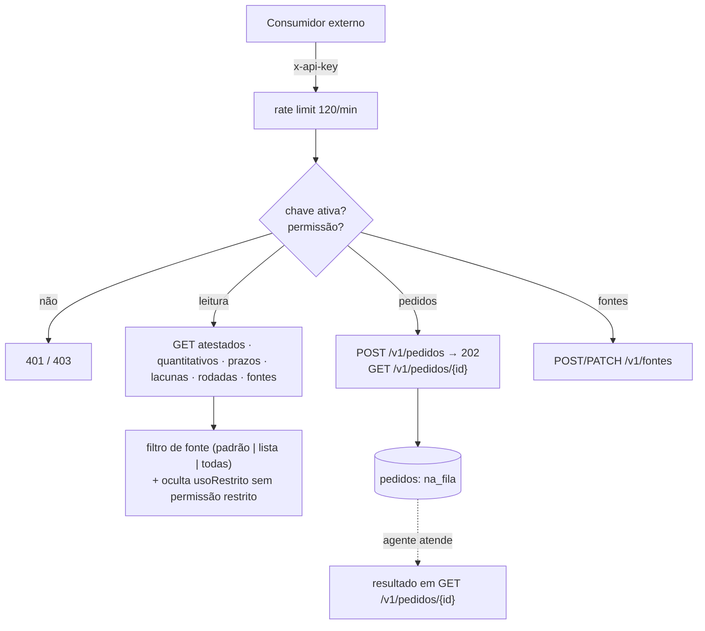
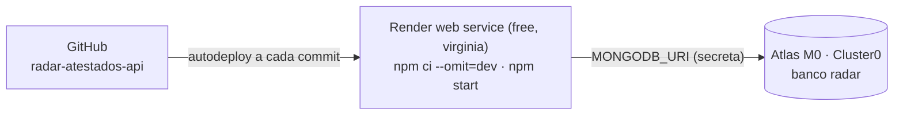

# Arquitetura do Radar de Atestados

Este documento descreve o que está construído: componentes, esquema do banco, fluxo de ingestão (SharePoint/OneDrive → agente → banco) e o consumo por outros players. Tudo aqui foi extraído do código em `src/` e `data/`; quando algo é inferência, está dito.

## 1. Visão geral



| Camada | Tecnologia | Papel |
| --- | --- | --- |
| Origem | SharePoint/OneDrive corporativo | Atestados (docx/pdf) e planilha de controle. Nunca é alterada. |
| Agente | Claude, tarefa agendada "Radar de Atestados CTC" | Lê as pastas, extrai metadados e quantitativos, classifica a força, grava o estado. |
| API | Node 20, Express 4, `express-rate-limit` (120 req/min) | Única porta de entrada do banco. Valida, autentica por chave, calcula prazos no dia. |
| Banco | MongoDB Atlas M0, banco `radar` | Guarda o estado analisado, as fontes, a fila de pedidos e as chaves. |

Decisão central: **só o agente grava o estado analisado**. Os demais consumidores leem e abrem pedidos; quem atende os pedidos é o agente.

## 2. Esquema do banco (`radar`)



### 2.1 Coleções

| Coleção | Chave | Quem escreve | Observação |
| --- | --- | --- | --- |
| `fontes` | `_id` = id da pasta | Consumidor com `fontes` (cria/altera); agente (status, `driveId`, `itemId`) | Apenas uma fonte tem `padrao: true`. Trocar o `link` volta o status para `aguardando_leitura`. |
| `atestados` | `(fonte, id)` único | Agente | Substituídos por inteiro a cada rodada da fonte. |
| `prazos` | — | Agente | `diasRestantes` e `severidade` **não são gravados**: a API calcula a cada leitura. |
| `lacunas` | — | Agente | Requisitos sem prova suficiente. |
| `rodadas` | — | Agente | Histórico de leituras; uma linha por rodada e fonte. |
| `pedidos` | `_id` UUID | Consumidor (cria); agente (status/resultado) | Fila de trabalho para o agente. |
| `consumidores` | `_id` = nome | Admin (`x-admin-token`) | Só o hash da chave é guardado; a chave aparece uma vez. |

### 2.2 `quantitativos[]` (dentro de `atestados`)

```json
{ "metrica": "usuarios", "valor": 3500, "comparador": null,
  "natureza": "executado", "trecho": "aproximadamente 3.500 usuários" }
```

`natureza` aceita `executado` ou `contratado`. O `trecho` é o texto literal do documento, para auditoria do número.

### 2.3 `pedidos.entrada`

- `indexacao`: `{ fonte }` (a fonte precisa existir).
- `cruzamento`: `{ fontes[], edital, requisitos[], querPacoteHabilitacao }`, com `requisitos[]` = `{ id, texto, metrica, minimo, tecnologia, concomitante, somatorioPermitido }` (1 a 200 itens).

### 2.4 Índices (criados na subida, idempotentes)

| Coleção | Índice |
| --- | --- |
| `atestados` | `{fonte, id}` único · `{frentes, forca}` · `{quantitativos.metrica, quantitativos.valor}` · `{tecnologias}` |
| `prazos` | `{fonte, data}` |
| `lacunas` | `{fonte}` |
| `rodadas` | `{fonte, geradoEm: -1}` |
| `pedidos` | `{status, criadoEm}` · `{consumidor, criadoEm: -1}` |
| `consumidores` | `{hash}` único |

## 3. Fluxo de ingestão: OneDrive/SharePoint → agente → banco

```mermaid
sequenceDiagram
  autonumber
  participant T as Tarefa agendada (Claude)
  participant SP as SharePoint / OneDrive
  participant API as API Radar (Render)
  participant DB as MongoDB Atlas

  T->>API: GET /v1/saude (acorda o serviço, ~1 min)
  T->>API: GET /v1/fontes
  API->>DB: fontes ativas
  DB-->>T: lista (status, driveId, itemId, ignorar, restritas)
  loop cada fonte ativa
    T->>SP: resolve a pasta pelo link (somente leitura)
    alt acesso negado ou link inválido
      T->>API: PATCH /v1/agente/fontes/{id} (status sem_acesso | link_invalido)
    else pasta lida
      T->>API: PATCH /v1/agente/fontes/{id} (driveId, itemId, status)
      T->>SP: lista arquivos (subpastas; ignora padrões; marca restritas)
      T->>SP: lê Controle de Atestados.xlsx e os documentos
      Note over T: extrai emitente, esfera, contrato, frentes,<br/>tecnologias, quantitativos com trecho literal,<br/>força A/B/C, alertas, versão vigente
      T->>API: PUT /v1/agente/fontes/{id}/estado {rodada, atestados, prazos, lacunas}
      API->>DB: transação: apaga e regrava atestados, prazos, lacunas da fonte
      API->>DB: insere rodada e marca a fonte como pronta
      API-->>T: { ok, atestados, prazos, lacunas }
    end
  end
  T->>API: GET /v1/agente/pedidos (na_fila)
  loop cada pedido
    T->>API: PATCH pedido (processando)
    T->>API: consulta o acervo (atestados, quantitativos)
    T->>API: PATCH pedido (concluido + resultado | erro)
  end
```

Pontos que o código garante:

- **Atomicidade:** o `PUT .../estado` roda numa transação. Ou todo o estado da fonte é trocado, ou nada muda.
- **Validação:** exige `rodada`, `atestados`, `prazos`, `lacunas`; `rodada.versaoEsquema` precisa ser `1.0`; todo atestado precisa de `id`. Corpo máximo de 2 MB.
- **Substituição, não merge:** o estado de uma fonte é sempre a última rodada completa. Atestados que saem da pasta somem do banco; o histórico fica só em `rodadas`.
- **Restritas:** a lista `restritas` da fonte marca pastas cujo conteúdo vira `usoRestrito: true`. Só chave com permissão `restrito` enxerga esses atestados.
- **Fonte nova:** nasce `aguardando_leitura`; o agente a pega na próxima execução e muda o status.

Não está no código desta API (inferência a partir do README): a leitura do SharePoint/OneDrive é feita pelo agente com o conector de Microsoft 365 do Claude, e o agendamento é a tarefa "Radar de Atestados CTC". A API não fala com a Microsoft; ela só recebe o resultado.

## 4. Fluxo de consumo: API para outros players



### 4.1 Permissões

| Permissão | Libera |
| --- | --- |
| `leitura` | Todos os `GET` de acervo |
| `pedidos` | Criar pedidos e ler os próprios resultados |
| `fontes` | Cadastrar e alterar fontes |
| `restrito` | Ver atestados com `usoRestrito: true` |
| `agente` | Gravar estado, atender a fila (`/v1/agente/*`); lê qualquer pedido |

Perfis previstos no README: `agente-radar` (`agente, leitura, pedidos, fontes, restrito`) e `player-externo` (`leitura, pedidos`).

### 4.2 Rotas

| Rota | Permissão | Notas |
| --- | --- | --- |
| `GET /v1/saude` | nenhuma | `ping` no banco; acorda o Render |
| `GET /v1/atestados`, `/{id}` | leitura | Filtros `frente`, `forca`, `esfera`, `tecnologia`, `q`, `limit`; só `versao.vigente` |
| `GET /v1/quantitativos` | leitura | Uma linha por número (`$unwind`); filtros `metrica`, `min`, `natureza` |
| `GET /v1/prazos` | leitura | `diasRestantes` e `severidade` calculados no dia (≤30 crítico, ≤120 atenção, senão planejado; `fila_parada` = fila) |
| `GET /v1/lacunas`, `/v1/rodadas`, `/v1/fontes` | leitura | `?fonte=` aceita um id, vários separados por vírgula ou `todas` |
| `POST /v1/pedidos`, `GET /v1/pedidos/{id}` | pedidos | Criação responde `202` |
| `POST /v1/fontes`, `PATCH /v1/fontes/{id}` | fontes | Link precisa ser `*.sharepoint.com` |
| `PUT /v1/agente/fontes/{fonte}/estado` | agente | Transação |
| `PATCH /v1/agente/fontes/{fonte}` | agente | status, `driveId`, `itemId`, `mensagem` |
| `GET /v1/agente/pedidos`, `PATCH /v1/agente/pedidos/{id}` | agente | Fila e resposta |
| `POST/GET/DELETE /v1/admin/consumidores` | `x-admin-token` | Cria (chave mostrada uma vez), lista, revoga |

### 4.3 Segurança

- Chaves por consumidor, guardadas como hash SHA-256; revogação não apaga, só marca `ativo: false`.
- `ADMIN_TOKEN` (mínimo 32 caracteres) comparado em tempo constante; a senha do banco fica só nas variáveis do Render.
- `query parser` simples: bloqueia objetos na query (injeção de operadores do Mongo). Buscas livres escapam regex.
- Atestados de pastas restritas ficam invisíveis para chaves sem `restrito`.

## 5. Implantação



Variáveis do serviço: `MONGODB_URI` (secreta), `MONGODB_DB=radar`, `ADMIN_TOKEN`, `SEED_INICIAL`, `NODE_VERSION=20`. Na primeira subida com banco vazio e `SEED_INICIAL=true`, a API cria a fonte `governo2-base-act` e carrega `data/estado-inicial-governo2.json` (99 atestados, 21 prazos, 8 lacunas).

Limites a ter em mente: o Render free dorme após 15 min sem uso (cerca de 1 min para acordar); o Atlas M0 tem 512 MB, não faz backup automático e pausa após 30 dias sem conexões; o domínio do Render precisa estar liberado em Admin settings › Capabilities para o agente conseguir gravar.
